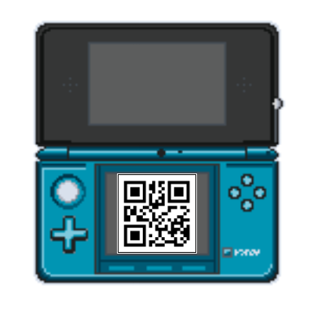

<h1 align='center'>3DS QR Code Generator</h1>
<p align='center'>Um simples gerador de códigos QR para instalar jogos no FBI</p>

 <div align="center">
  
</div>

## Propósito:

O propósito deste repositório é facilitar um pouco o processo de instalação de jogos no Nintendo 3DS, pois como você já deve saber, quando instalamos um jogo movendo arquivos para o armazenamento interno do 3DS isso custa o dobro de memória interna (o espaço consumido pelo arquivo ```.cia``` e o espaço necessário para instalar o jogo) e mesmo que você selecione a opção de apagar o arquivo ```.cia``` no final da instalação, particularmente falando, é deveras incoveniente ter que apagar um arquivo que eu gostaria de manter guardado. Pensando nesses problemas, decidi criar um script simples que gera um código QR e a partir dele eu possa instalar um jogo de forma bem mais prática. "Mas por que utilizar o Google Drive?" Simplesmente para manter os arquivos seguros em um cloud service, assim eu também posso economizar a memória dos meus dispositivos.

## Como utilizar:

#### Clonando o repositório
Antes de iniciarmos, clone o repositório para ter acesso local de todos os arquivos necessários, você pode fazer isso utilizando o seguinte comando:

```
git clone https://github.com/LonelyALpHaz/3ds-qrcode-generator.git
```

#### Gerando o QR code
1. Faça upload do jogo que você deseja instalar para o [Google Drive](https://www.google.com/intl/pt-br/drive/about.html), certifique-se de fazer o **dump** de jogos originais nesse processo e utilize **somente** jogos com o formato ```.cia```, caso contrário, o FBI não conseguirá instalar o jogo;
2. Torne o acesso ao arquivo público indo em ```Compartilhar > Acesso Geral > Qualquer pessoa com o link``` e copie o link do arquivo;
3. Inicie o ```qr_code.py``` disponível neste repositório, insira o link copiado no campo "URL" e depois clique no botão "Gerar", aguarde alguns segundos e o código QR irá aparecer na interface do programa.

#### Instalando o jogo no 3DS
1. Abra o aplicativo FBI no seu Nintendo 3DS e na primeira tela selecione as opções ```Remote Install > Scan QR Code```;
2. Aponte a câmera do seu 3DS para o código QR que foi gerado anteriormente e, na tela inferior, clique em "Yes" para permitir o download via QR code;
3. Aguarde enquanto o jogo é instalado e, ao final do processo, clique em "OK" para finalizar a instalação;
4. Ao voltar para a tela inicial do console, ele irá apresentar a clássica tela com o presente, basta abrí-lo e se divertir com o seu novo jogo.

## Recursos utilizados:

Nesse projeto foi utilizada a linguagem ```Python``` na versão 3.11.1, os módulos ```pypng``` e ```pyqrcode``` para gerar o código QR e o módulo ```Tkinter``` para criar a interface gráfica.

## Ressalva:

Sou um programador junior, então caso erros sejam encontrados no script ou se você tiver sugestões de como eu posso melhorar o projeto, sinta-se livre para abrir uma issue!
